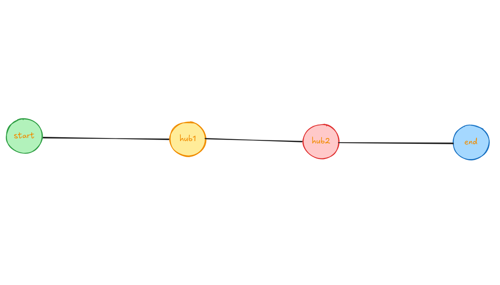
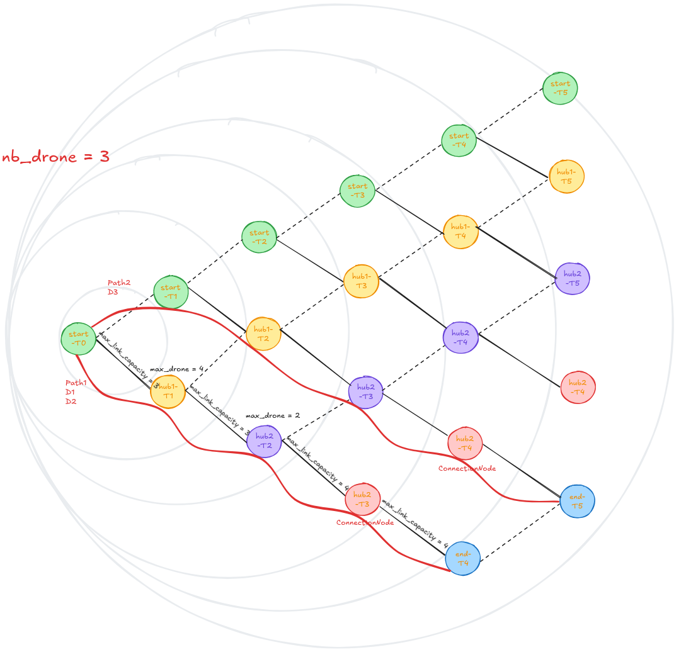

*This project was created as part of the 42 curriculum by flauweri.*

## Description

Fly-in is a drone routing simulator. The goal of the project is to compute and display trajectories that send a specified number of drones from a start hub to an end hub. The project must enforce capacity constraints on hubs and links, as well as rules related to zones (normal, priority, restricted, blocked). The simulator validates a map file, builds a time-expanded graph, searches for valid routing paths, and displays the simulation.

## Instructions

- To run the application (interactive map selection):

	```bash
	make run
	```

- To install the virtual environment:

	```bash
	make install
	```

- To prepare the provided maps:

	```bash
	make map
	```

- To run using a specific folder:

	```bash
	make ARG="--directory folder_name"
	make ARG="--d folder_name"
	```

- To run using a specific map file:

	```bash
	make ARG="--input maps/map_name.txt"
	make ARG="--i maps/map_name.txt"
	```

- Cleanup and utilities:

	```bash
	make clean
	```

- Check mypy and flake8:

	```bash
	make lint
	make lint-strict
	```

## Resources

- Flow algorithms: documentation and articles on Edmonds–Karp, Dinic, and network flows.
- Pygame: https://www.pygame.org/
- Pydantic: https://docs.pydantic.dev/
- Questionary: https://questionary.readthedocs.io/en/stable/
- map editor: https://flyin-editor.cheznestor.fr/

AI usage:
- Structure and translate the `README.md` and docstrings.
- No source code was generated or modified by the AI.

## Algorithm choices and implementation strategy





- Temporal representation: the graph is time-expanded — each hub is instantiated for each required time step. This models drone movement between time steps and allows enforcing capacities on hubs and links.
- Nodes and edges:
  - `Node` represents a hub at a given time; it tracks outgoing edges and the number of traversals.
  - `Edge` represents a link (or a static wait) with a link capacity (`max_link_capacity`).
- Path search:
  - A depth-first search (DFS) is used to extract augmenting paths in the time-dependent graph.
  - For each found path, the blocking flow is computed by checking remaining capacities of the edges and the nodes (hubs) on the path, then this flow is applied to each node and edge (incrementing the `passage` counters).
  - Edges are sorted to prefer `PRIORITY` zones when choices exist, encouraging the use of priority hubs to improve user experience or satisfy business constraints.
- Execution loop:
  - The network is built progressively via `Network.next_step()` until the end hub is found or a repetition threshold is reached.
  - Repeated extraction of augmenting paths (`DFS.get_max_flow()`) is applied until the required number of drones (`map.nb_drones`) is reached or no more possibilities remain.

## Visual representation and user experience

- Adaptive scaling: the display automatically calculates scale and center so the map fits the window (padding, scale, origin).
- Themes and colors: supports an `assets/themes.json` file to customize background, line, and text colors; theme switching is available.
- Hubs and links: hubs are drawn with sizes depending on the scale; links are drawn as lines. Priority/restricted hubs are rendered with different colors and styles to visually indicate their effects on routes.
- Drones: graphical icons (`assets/drone_icon.png`) are used to animate drones along found paths. Animation proceeds step-by-step following the internal clock and the length of the extracted paths.
- Text and information: the map name and other useful information are shown during the simulation (font included in `assets` if available).

These visual elements help users understand:
- why some drones take different routes (priority / capacity),
- where saturations or blockages occur (restricted zones / capacity reached),
- the temporal evolution of movements (step-by-step animation).

## Project structure

- `src/parser.py`: reads and validates map files (.txt) and constructs the `Map` object.
- `src/network.py`: builds the time-expanded graph (nodes, edges) and advances it by time steps.
- `src/algo.py`: searches for augmenting paths, computes flows, and applies traversals.
- `src/output.py`: generates text output (list of movements per step) and creates `Drone` objects.
- `src/display.py`: Pygame display of the map and drone animation.
